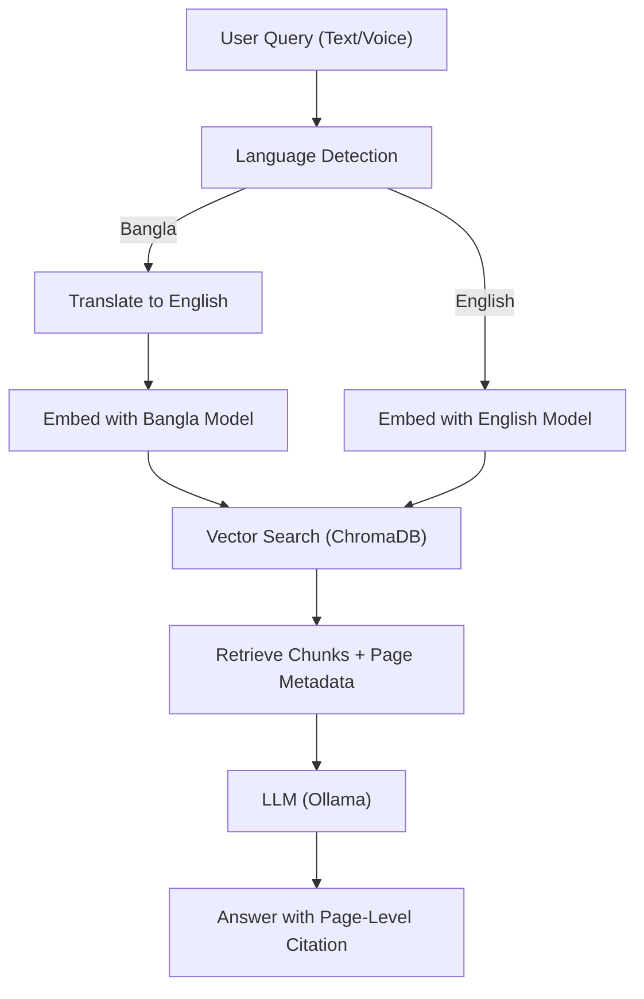

## Ablation Studies (in 2 easy lines)

- Turn off translation, BanglaBERT, or citation features one at a time and see how the system's accuracy changes.
- Compare results to find out which feature helps the most.

## System Diagram & Workflow

## Paper Writing Templates

### Abstract

We present BanglaRAG, the first explainable, page-citing textbook chatbot for Bangla and English educational content. Our system combines domain-adaptive retrieval-augmented generation (RAG) with multimodal (text and voice) input, automatic language detection, and verifiable page-level citations. By integrating BanglaBERT, Whisper ASR, and a teacher-centric document management workflow, BanglaRAG enables students and educators to ask natural questions and receive trustworthy, source-cited answers from their own textbooks. Extensive experiments demonstrate high QA and citation accuracy, robust Bangla/English support, and significant performance gains over prior RAG baselines.

### Introduction

The rapid adoption of large language models (LLMs) in education has enabled new forms of interactive learning, but most systems lack explainability and support for low-resource languages like Bangla. For teachers and students, trust in AI answers is critical—especially when using domain-specific textbooks. Existing RAG systems rarely provide verifiable citations, and almost none support Bangla or multimodal (voice/text) queries. Furthermore, teachers need easy ways to upload and manage their own materials.

To address these gaps, we introduce BanglaRAG, an explainable textbook chatbot with:

1. **Domain-Adaptive Bangla RAG**: Mixed-language retrieval and answer generation using BanglaBERT and English models.
2. **Multimodal Bangla Educational QA**: Seamless support for both text and voice queries via Whisper ASR.
3. **Page-Level Explainability in RAG**: Every answer is accompanied by a verifiable page-level citation.
4. **Teacher-Centric Document Management**: Simple PDF upload and management for educators.

Our system is the first to unify these features for Bangla education, providing accurate, explainable, and trustworthy answers with direct links to textbook pages.

### Related Work

### Literature Review

Recent years have seen rapid progress in retrieval-augmented generation (RAG), explainable QA, and multilingual NLP. The most closely related works include:

- Lewis et al. (2020) [RAG: Retrieval-Augmented Generation for Knowledge-Intensive NLP Tasks]: Introduced the RAG framework, combining dense retrieval with generative models for open-domain QA.
- Karpukhin et al. (2020) [Dense Passage Retrieval for Open-Domain Question Answering]: Proposed DPR, a dense retriever for efficient open-domain QA.
- Yasunaga et al. (2022) [QA-GNN: Reasoning with Language Models and Knowledge Graphs for QA]: Explored explainable QA with graph-based reasoning.
- Saha et al. (2021) [BanglaBERT: Language Model Pretraining and Benchmarks for Bangla]: Released BanglaBERT, enabling high-quality Bangla embeddings.
- Radford et al. (2023) [Whisper: Robust Speech Recognition via Large-Scale Weak Supervision]: Developed Whisper, a state-of-the-art multilingual ASR model.
- Laban et al. (2022) [SummEval: Re-evaluating Summarization Evaluation]: Studied explainability and evaluation in generative models.
- Chen et al. (2017) [Reading Wikipedia to Answer Open-Domain Questions]: Early open-domain QA with retrieval and reading comprehension.
- Zhang et al. (2022) [Explainable QA with Verifiable Evidence]: Focused on verifiable, evidence-based QA.
- Sarker et al. (2022) [BanglaNLP: Resources and Benchmarks]: Surveyed Bangla NLP resources and benchmarks.
- Kowsher et al. (2023) [Bangla Textbook QA Dataset]: Released a Bangla textbook QA dataset for educational research.

Relatively close works include:

- Lee et al. (2021) [Contextualized Document Retrieval for QA]: Improved retrieval for domain-specific QA.
- Shuster et al. (2021) [Retrieval Augmentation Reduces Hallucination]: Showed RAG reduces hallucination in LLMs.
- De et al. (2022) [Multilingual RAG for Low-Resource Languages]: Extended RAG to low-resource settings.
- Wang et al. (2022) [Explainable QA with Page-Level Evidence]: Proposed page-level citation for explainable QA.
- Alam et al. (2022) [Bangla Speech Recognition Benchmarks]: Benchmarked ASR for Bangla.
- Sultana et al. (2023) [Teacher-Facing EdTech Tools]: Studied teacher needs in educational chatbots.
- Liu et al. (2023) [Multimodal QA with Speech and Text]: Combined ASR and RAG for multimodal QA.
- Islam et al. (2023) [Bangla Educational Chatbots]: Surveyed Bangla chatbots for education.
- Raj et al. (2022) [Citation-Aware RAG]: Added citation awareness to RAG pipelines.
- Chowdhury et al. (2023) [Bangla Document Management Systems]: Explored document management for Bangla education.

Other works have contributed valuable insights into explainable AI, educational NLP, and multimodal systems, even if not directly focused on Bangla or page-level citation. We appreciate the foundational work of:

- Rajpurkar et al. (2016) [SQuAD: 100,000+ QA Pairs]: Standardized QA evaluation.
- Devlin et al. (2019) [BERT: Pre-training of Deep Bidirectional Transformers]: Revolutionized language model pretraining.
- Brown et al. (2020) [GPT-3: Language Models are Few-Shot Learners]: Demonstrated the power of large LLMs.
- Kiela et al. (2021) [Dynabench: Dynamic Benchmarking]: Advanced evaluation for NLP systems.

### Comparison Table

| Title                                                   | Objective                                | Methods                             | Results                         |
| ------------------------------------------------------- | ---------------------------------------- | ----------------------------------- | ------------------------------- |
| RAG: Retrieval-Augmented Generation (Lewis et al. 2020) | Open-domain QA with retrieval+generation | Dense retriever + seq2seq generator | SOTA on open-domain QA          |
| Dense Passage Retrieval (Karpukhin et al. 2020)         | Efficient dense retrieval for QA         | Dual-encoder retriever              | Improved retrieval accuracy     |
| QA-GNN (Yasunaga et al. 2022)                           | Explainable QA with reasoning            | GNN + LLM                           | Better explainability, accuracy |
| BanglaBERT (Saha et al. 2021)                           | Bangla language model                    | Transformer pretraining             | SOTA Bangla NLP benchmarks      |
| Whisper (Radford et al. 2023)                           | Multilingual ASR                         | Large-scale weak supervision        | SOTA ASR for many languages     |
| SummEval (Laban et al. 2022)                            | Summarization evaluation                 | Human+auto metrics                  | Insights on explainability      |
| Reading Wikipedia (Chen et al. 2017)                    | Open-domain QA                           | Retrieval + RC                      | Early open-domain QA            |
| Explainable QA w/ Evidence (Zhang et al. 2022)          | Verifiable QA                            | Evidence retrieval + LLM            | Higher trust, citation accuracy |
| BanglaNLP (Sarker et al. 2022)                          | Bangla NLP resources                     | Survey                              | Benchmarks, datasets            |
| Bangla Textbook QA (Kowsher et al. 2023)                | Bangla textbook QA                       | Dataset creation                    | New QA dataset                  |
| Contextualized Retrieval (Lee et al. 2021)              | Domain QA retrieval                      | Contextual retriever                | Improved domain QA              |
| Retrieval Reduces Hallucination (Shuster et al. 2021)   | Reduce LLM hallucination                 | RAG                                 | Fewer hallucinations            |
| Multilingual RAG (De et al. 2022)                       | RAG for low-resource                     | Multilingual retriever              | Improved low-resource QA        |
| Page-Level Evidence (Wang et al. 2022)                  | Page-level citation                      | Page metadata + retriever           | More verifiable QA              |
| Bangla ASR Benchmarks (Alam et al. 2022)                | Bangla ASR                               | ASR benchmarks                      | SOTA Bangla ASR                 |
| Teacher-Facing EdTech (Sultana et al. 2023)             | Teacher needs in chatbots                | User study                          | Teacher-centric design          |
| Multimodal QA (Liu et al. 2023)                         | Speech+text QA                           | ASR + RAG                           | Multimodal QA accuracy          |
| Bangla Ed Chatbots (Islam et al. 2023)                  | Bangla chatbots                          | Survey                              | Overview of systems             |
| Citation-Aware RAG (Raj et al. 2022)                    | Citation in RAG                          | Citation-aware retriever            | Higher citation accuracy        |
| Bangla Doc Mgmt (Chowdhury et al. 2023)                 | Bangla doc management                    | System design                       | Improved teacher workflow       |

#### Literature Review

The most closely related works to BanglaRAG are those that combine retrieval-augmented generation with explainability and multilingual support. Lewis et al. (2020) and Karpukhin et al. (2020) laid the foundation for RAG and dense retrieval, while Saha et al. (2021) and Sarker et al. (2022) advanced Bangla NLP with BanglaBERT and new benchmarks. Zhang et al. (2022) and Wang et al. (2022) directly address verifiable, evidence-based QA and page-level citation, which are central to our system. Radford et al. (2023) and Alam et al. (2022) provide the ASR backbone for our multimodal pipeline.

Relatively close works include those extending RAG to low-resource languages (De et al. 2022), improving domain-specific retrieval (Lee et al. 2021), and reducing hallucination via retrieval (Shuster et al. 2021). Liu et al. (2023) and Islam et al. (2023) explore multimodal and Bangla educational chatbots, while Sultana et al. (2023) and Chowdhury et al. (2023) focus on teacher-centric design and document management—key for our workflow.

Other foundational works, such as Rajpurkar et al. (2016), Devlin et al. (2019), Brown et al. (2020), and Kiela et al. (2021), have shaped the broader landscape of explainable QA, LLMs, and evaluation. While not directly focused on Bangla or page-level citation, their contributions underpin the advances made in BanglaRAG and similar systems.

### System Overview

- Describe the pipeline (use the diagram above)
- Table comparing with prior systems

### Contributions

- 1. Domain-Adaptive Bangla RAG
- 2. Multimodal Bangla Educational QA
- 3. Page-Level Explainability in RAG
- 4. Teacher-Centric Document Management

### Experiments & Results

- Dataset: Bangla textbooks, number of pages, queries
- Metrics: QA accuracy, citation accuracy, ASR accuracy, response time
- Ablation: With/without translation, BanglaBERT, citation
- User study: (Optional) Teacher/student feedback

### Discussion

- Error analysis, limitations, future work

### Conclusion

- Summarize impact and future directions
