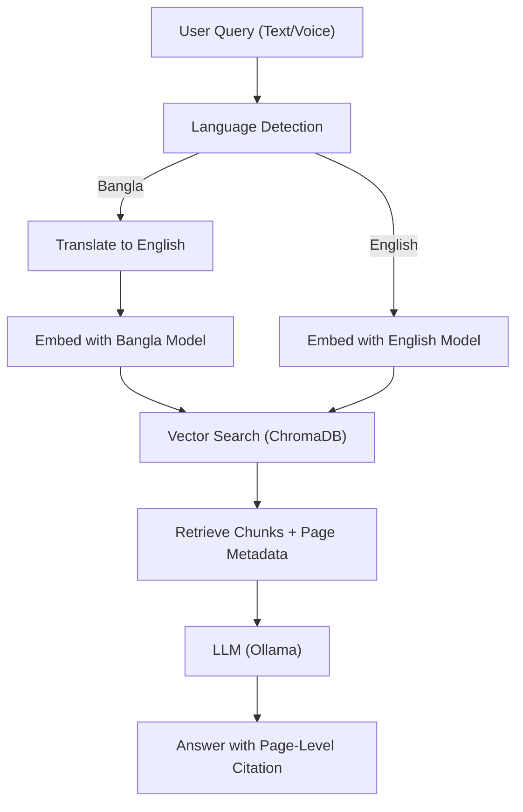

## Ablation Studies (in 2 easy lines)

- Turn off translation, BanglaBERT, or citation features one at a time and see how the system's accuracy changes.
- Compare results to find out which feature helps the most.

## System Diagram & Workflow

## Paper Writing Templates

### Abstract

Briefly describe your system, its explainability, and Bangla/English support.

### Introduction

- Why explainable Bangla textbook chatbots are needed
- Challenges (multilinguality, explainability, teacher usability)
- Your contributions (list 4 main points)

### Related Work

- Cite RAG, Bangla NLP, explainable QA, multimodal QA, educational chatbots

### System Overview

- Describe the pipeline (use the diagram above)
- Table comparing with prior systems

### Contributions

- 1. Domain-Adaptive Bangla RAG
- 2. Multimodal Bangla Educational QA
- 3. Page-Level Explainability in RAG
- 4. Teacher-Centric Document Management

### Experiments & Results

- Dataset: Bangla textbooks, number of pages, queries
- Metrics: QA accuracy, citation accuracy, ASR accuracy, response time
- Ablation: With/without translation, BanglaBERT, citation
- User study: (Optional) Teacher/student feedback

### Discussion

- Error analysis, limitations, future work

### Conclusion

- Summarize impact and future directions
