# 🌐 BanglaRAG System

A comprehensive **Retrieval-Augmented Generation (RAG)** system that supports **mixed-language** (English & Bangla) text and **voice input** for chatting with PDF documents. This advanced system combines cutting-edge AI models with multilingual capabilities to create an intelligent knowledge base from your academic and professional documents.

## 🌟 Features

### 📚 Core RAG Capabilities

- **📄 PDF Processing**: Automatically load and process PDF documents with metadata preservation
- **🔍 Intelligent Chunking**: Split documents with language-aware segmentation for English and Bangla
- **🧠 Mixed-Language Embeddings**: Use specialized models (BanglaBERT for Bangla, Nomic Embed for English)
- **💾 Persistent Storage**: Store embeddings in ChromaDB with comprehensive metadata
- **🤖 AI Chat Interface**: Interactive chat powered by Ollama LLMs with cross-language support

### 🎤 Voice Input Features

- **🎙️ Voice-to-Text**: Whisper-powered ASR supporting multiple languages
- **🔊 Interactive Voice Sessions**: Real-time voice query processing
- **📱 Hands-Free Operation**: Complete voice-driven interaction capabilities
- **🌐 Multilingual Voice Support**: Voice input in English and Bangla

### 🌍 Multilingual Support

- **🔤 Language Detection**: Automatic detection of English vs Bangla text
- **🧠 Specialized Models**: BanglaBERT for Bangla, Nomic Embed for English
- **✂️ Language-Aware Chunking**: Indic NLP tokenization for proper Bangla segmentation
- **📊 Cross-Language Evaluation**: Comprehensive testing across languages

### 📋 Advanced Features

- **📖 Page-Level Citations**: Precise source attribution with file names and page numbers
- **🧪 Comprehensive Testing**: Mixed-language testing suite with evaluation metrics
- **📊 System Monitoring**: Real-time status and performance monitoring
- **🔄 Robust Pipeline**: End-to-end processing with error handling

## 🏗️ System Architecture

```mermaid
graph TD
    A["📄 PDF Documents"] --> B["🔍 Document Loader<br/>(loader.py)"]
    B --> C["✂️ Language-Aware Splitter<br/>(split.py)"]
    C --> D["🏷️ ID Assignment<br/>(assign_ids.py)"]
    D --> E["🧠 Mixed-Language Embedding<br/>(embedding.py)"]
    E --> F["💾 Vector Database<br/>(ChromaDB)"]

    F --> G["🔎 Query Engine<br/>(query_database.py)"]
    G --> H["🤖 Ollama LLM<br/>(ollama_llm.py)"]
    H --> I["💬 Interactive Chat<br/>(main.py)"]

    J["🎤 Voice Input<br/>(voice_input.py)"] --> G
    K["🛠️ Database Creator<br/>(create_database.py)"] --> F
    L["🧪 BanglaRAG Tester<br/>(test_rag.py)"] --> F
    L --> H

    style E fill:#e1f5fe
    style J fill:#f3e5f5
    style L fill:#e8f5e8
```



## 🚀 Quick Start

### Prerequisites

- **Python 3.8+**
- **Ollama** (for LLM functionality)
- **Git** (for cloning)
- **Microphone** (for voice input features)

### Installation

1. **Clone the repository**

   ```bash
   git clone <your-repository-url>
   cd BanglaRAG-System
   ```

2. **Create and activate virtual environment**

   ```bash
   # On Windows
   python -m venv venv
   venv\Scripts\Activate.ps1

   # On macOS/Linux
   python -m venv venv
   source venv/bin/activate
   ```

3. **Install dependencies**

   ```bash
   pip install -r requirements.txt
   ```

   **BanglaRAG Dependencies:**

   - `langdetect` - Language detection for mixed content
   - `sentence-transformers` - Advanced embedding models including BanglaBERT
   - `transformers` & `torch` - Transformer models and PyTorch backend
   - `openai-whisper` - Voice input transcription with multilingual support
   - `pyaudio` - Audio recording capabilities
   - `indic-nlp-library` - Bangla text processing and tokenization
   - `huggingface-hub` - Model downloading and management

4. **Install and setup Ollama**

   - Download from: https://ollama.ai/
   - Install required models:

   ```bash
   ollama pull nomic-embed-text  # For English embeddings
   ollama pull phi3              # For chat (recommended for multilingual)
   ```

5. **Setup Voice Input (Optional)**
   - **Windows**: Install Microsoft Visual C++ Build Tools
   - **macOS**: Install Xcode command line tools
   - **Linux**: Install `portaudio19-dev` and `python3-dev`

### Usage

1. **Add your PDF documents**

   - Place your PDF files in the project root directory
   - Supports English, Bangla, and mixed-language documents

2. **Run the BanglaRAG system**

   ```bash
   python main.py
   ```

3. **Navigate the comprehensive menu**:
   - **Option 1**: 📊 Show System Status
   - **Option 2**: 🔄 Process Documents (Create/Update Database)
   - **Option 3**: 🔍 Test Database Queries
   - **Option 4**: 💬 Interactive Chat Session
   - **Option 5**: 🎤 Voice Input Session
   - **Option 6**: 🎙️ Single Voice Query
   - **Option 7**: 🌐 Mixed Language Demo
   - **Option 8**: 🧪 Run System Tests
   - **Option 9**: 🔬 Voice Input Tests
   - **Option 10**: 🛠️ Check Dependencies
   - **Option 11**: 🚪 Exit

## 📋 Detailed Setup Instructions

### First Time Setup

1. **Process your documents** (Option 2 in main menu)

   - The system will automatically:
     - Load all PDF files from the current directory
     - Detect language and apply appropriate chunking
     - Generate embeddings using specialized models
     - Create a searchable vector database with metadata

2. **Verify setup** (Option 3 in main menu)

   - Test the database with sample queries
   - Verify page-level citations are working

3. **Test voice input** (Option 9 in main menu)

   - Verify microphone and Whisper functionality
   - Test voice transcription accuracy

4. **Start chatting** (Option 4 in main menu)
   - Ask questions in English or Bangla
   - Get AI-powered answers with precise page citations

### Voice Input Setup

1. **Microphone Configuration**

   - Ensure microphone is connected and working
   - Test with system audio settings
   - Grant microphone permissions if prompted

2. **Whisper Model Download**

   - First voice query will download Whisper model
   - Requires internet connection and ~1GB storage
   - Supports multiple languages including Bangla

3. **Audio Quality Tips**
   - Use good quality microphone
   - Minimize background noise
   - Speak clearly at moderate pace
   - Default recording duration: 5 seconds

### System Requirements

- **Memory**: 8GB+ RAM recommended (for BanglaBERT and Whisper)
- **Storage**: 5GB+ free space (for models and embeddings)
- **Network**: Internet connection for initial model downloads
- **GPU**: Optional but recommended for faster processing

## 🧪 Testing

The system includes comprehensive multilingual testing:

```bash
# Run through main menu (Option 8)
python main.py

# Or run directly
python test_rag.py
```

### Test Coverage

- **English Algorithm Questions**: Core CS concepts
- **Bangla Algorithm Questions**: Same concepts in Bangla
- **Mixed Language Evaluation**: Cross-language consistency
- **Advanced Textbook Concepts**: Complex topics
- **Negative Test Cases**: Out-of-domain queries
- **Voice Input Tests**: Audio processing pipeline

### Evaluation Metrics

- **Overall Pass Rate**: System-wide performance
- **Language-Specific Rates**: English vs Bangla performance
- **Confidence Distribution**: Answer quality assessment
- **Response Time Analysis**: Performance metrics
- **Page Citation Accuracy**: Source attribution verification

## 📁 Project Structure

```
BanglaRAG-System/
├── main.py                 # Main application runner with voice support
├── loader.py              # PDF document loading with metadata
├── split.py               # Language-aware document chunking
├── assign_ids.py          # Unique ID assignment
├── embedding.py           # Mixed-language embedding generation
├── create_database.py     # Vector database creation
├── query_database.py      # Database querying with citations
├── ollama_llm.py          # LLM integration
├── voice_input.py         # Voice input processing with Whisper
├── test_rag.py           # Comprehensive testing suite
├── test_voice_demo.py    # Voice input demonstration
├── requirements.txt       # Python dependencies
├── db/                   # Vector database storage
└── venv/                 # Virtual environment
```

## 🔧 Configuration

### Customizing Models

**Embedding Models** (in `embedding.py`):

- English: `nomic-embed-text` (Ollama)
- Bangla: `sagorsarker/bangla-bert-base` (HuggingFace)

**Chat Models** (in `ollama_llm.py`):

- Primary: `phi3` (recommended for multilingual)
- Fallback: `llama2` or other Ollama models

**Voice Models** (in `voice_input.py`):

- Whisper: `base` model (configurable to `small`, `medium`, `large`)

### Adjusting Processing Parameters

**Chunking** (in `split.py`):

```python
chunk_size = 1000      # Characters per chunk
chunk_overlap = 200    # Overlap between chunks
```

**Voice Input** (in `voice_input.py`):

```python
recording_duration = 5  # Seconds
sample_rate = 44100    # Audio sample rate
```

## 🐛 Troubleshooting

### Common Issues

1. **Voice Input Not Working**

   - Check microphone permissions
   - Verify PyAudio installation
   - Test with `python -c "import pyaudio; print('PyAudio OK')"`

2. **Bangla Text Processing Issues**

   - Ensure UTF-8 encoding for Bangla PDFs
   - Check Indic NLP library installation
   - Verify BanglaBERT model download

3. **Model Download Failures**

   - Check internet connection
   - Verify HuggingFace access
   - Clear cache: `rm -rf ~/.cache/huggingface/`

4. **Memory Issues**
   - Reduce chunk size in `split.py`
   - Use smaller Whisper model
   - Process fewer documents at once

### Performance Optimization

1. **Faster Processing**

   - Use GPU acceleration if available
   - Reduce embedding dimensions
   - Implement batch processing

2. **Memory Management**
   - Process documents in smaller batches
   - Clear embeddings cache regularly
   - Monitor system resources

### Getting Help

1. Check system status (Option 1 in main menu)
2. Run dependency check (Option 10 in main menu)
3. Review console output for specific error messages
4. Test individual components with respective test functions

## 🤝 Contributing

1. Fork the repository
2. Create a feature branch
3. Make your changes
4. Add tests for new functionality
5. Ensure all tests pass
6. Submit a pull request

## 📄 License

This project is open source. Please check the license file for details.

## 🔗 Dependencies

### Core Dependencies

- **langchain**: Framework for building AI applications
- **langchain-community**: Community integrations
- **langchain-ollama**: Ollama integration
- **langchain-chroma**: ChromaDB integration
- **chromadb**: Vector database
- **pypdf**: PDF processing

### BanglaRAG Extensions

- **langdetect**: Language detection
- **sentence-transformers**: Advanced embedding models
- **transformers**: Transformer models including BanglaBERT
- **torch**: PyTorch backend
- **openai-whisper**: Voice input transcription
- **pyaudio**: Audio recording
- **indic-nlp-library**: Bangla text processing
- **huggingface-hub**: Model management

### Testing & Development

- **pytest**: Testing framework
- **json**: Test result reporting
- **datetime**: Timestamp management

## 🆕 Version History

- **v1.0**: Initial release with basic RAG functionality
- **v2.0**: BanglaRAG system with mixed-language support
  - Added BanglaBERT integration
  - Language-aware chunking
  - Comprehensive testing suite
- **v2.1**: Voice input capabilities
  - Whisper ASR integration
  - Interactive voice sessions
  - Voice testing framework
- **Current**: Full-featured BanglaRAG system with voice input

## 🌟 Key Achievements

- **🎯 Mixed-Language Processing**: Seamless English & Bangla support
- **🎤 Voice Integration**: Complete voice-to-text pipeline
- **📚 Academic Focus**: Optimized for textbook and research content
- **📊 Comprehensive Testing**: 20+ test cases across languages
- **🔗 Page-Level Citations**: Precise source attribution
- **🚀 Production Ready**: Robust error handling and monitoring

---

**Happy chatting with your multilingual PDFs! 🎉 | আপনার বহুভাষিক পিডিএফগুলির সাথে আনন্দদায়ক কথোপকথন! 🌐**
