# 🤖 Chat PDF RAG System

A **Retrieval-Augmented Generation (RAG)** system that allows you to chat with PDF documents using AI. Upload your PDFs, and the system will create a searchable knowledge base that you can query in natural language.

## 🌟 Features

- **📄 PDF Processing**: Automatically load and process PDF documents
- **🔍 Intelligent Chunking**: Split documents into semantically meaningful chunks
- **🧠 Vector Embeddings**: Create high-quality embeddings using Nomic Embed Text
- **💾 Persistent Storage**: Store embeddings in ChromaDB for fast retrieval
- **🤖 AI Chat Interface**: Interactive chat powered by Ollama LLMs
- **🧪 Comprehensive Testing**: Built-in testing suite for system validation
- **📊 System Monitoring**: Real-time status and performance monitoring

## 🏗️ System Architecture

```mermaid
graph TD
    A["📄 PDF Documents"] --> B["🔍 Document Loader<br/>(loader.py)"]
    B --> C["✂️ Text Splitter<br/>(split.py)"]
    C --> D["🏷️ ID Assignment<br/>(assign_ids.py)"]
    D --> E["🧠 Embedding Generation<br/>(embedding.py)"]
    E --> F["💾 Vector Database<br/>(ChromaDB)"]

    F --> G["🔎 Query Engine<br/>(query_database.py)"]
    G --> H["🤖 Ollama LLM<br/>(ollama_llm.py)"]
    H --> I["💬 Interactive Chat<br/>(main.py)"]

    J["🛠️ Database Creator<br/>(create_database.py)"] --> F
    K["🧪 RAG Tester<br/>(test_rag.py)"] --> F
    K --> H
```



## 🚀 Quick Start

### Prerequisites

- **Python 3.8+**
- **Ollama** (for LLM functionality)
- **Git** (for cloning)

### Installation

1. **Clone the repository**

   ```bash
   git clone <your-repository-url>
   cd Chat_pdf_RAG_system
   ```

2. **Create and activate virtual environment**

   ```bash
   # On Windows
   python -m venv venv
   venv\Scripts\Activate.ps1

   # On macOS/Linux
   python -m venv venv
   source venv/bin/activate
   ```

3. **Install dependencies**

   ```bash
   pip install -r requirements.txt
   ```

4. **Install and setup Ollama**
   - Download from: https://ollama.ai/
   - Install required models:
   ```bash
   ollama pull nomic-embed-text  # For embeddings
   ollama pull llama2            # For chat (or any other model you prefer)
   ```

### Usage

1. **Add your PDF documents**

   - Place your PDF files in the project root directory

2. **Run the main system**

   ```bash
   python main.py
   ```

3. **Follow the interactive menu**:
   - **Option 1**: Check system status
   - **Option 2**: Process documents and create database
   - **Option 3**: Start interactive chat
   - **Option 4**: Test database queries
   - **Option 5**: Run system tests

## 📋 Detailed Setup Instructions

### First Time Setup

1. **Process your documents** (Option 2 in main menu)

   - The system will automatically:
     - Load all PDF files from the current directory
     - Split them into optimized chunks
     - Generate embeddings
     - Create a searchable vector database

2. **Verify setup** (Option 4 in main menu)

   - Test the database with sample queries
   - Ensure all components are working correctly

3. **Start chatting** (Option 3 in main menu)
   - Ask questions about your documents
   - Get AI-powered answers with source citations

### System Requirements

- **Memory**: 4GB+ RAM recommended
- **Storage**: 2GB+ free space (for embeddings and models)
- **Network**: Internet connection for initial Ollama model downloads

## 🧪 Testing

The system includes comprehensive testing:

```bash
# Run through main menu (Option 5)
python main.py

# Or run directly
python test_rag.py
```

Tests include:

- Database connectivity
- Embedding generation
- Query accuracy
- Response quality
- System integration

## 📁 Project Structure

```
Chat_pdf_RAG_system/
├── main.py                 # Main application runner
├── loader.py              # PDF document loading
├── split.py               # Document chunking
├── assign_ids.py          # Unique ID assignment
├── embedding.py           # Embedding generation
├── create_database.py     # Vector database creation
├── query_database.py      # Database querying
├── ollama_llm.py          # LLM integration
├── test_rag.py           # Testing suite
├── requirements.txt       # Python dependencies
├── db/                   # Vector database storage
└── venv/                 # Virtual environment
```

## 🔧 Configuration

### Customizing Models

Edit the model configurations in:

- `embedding.py`: Change embedding model
- `ollama_llm.py`: Change chat LLM model

### Adjusting Chunk Size

Modify chunking parameters in `split.py`:

```python
chunk_size = 1000      # Characters per chunk
chunk_overlap = 200    # Overlap between chunks
```

## 🐛 Troubleshooting

### Common Issues

1. **Ollama connection failed**

   - Ensure Ollama is installed and running
   - Check if required models are downloaded

2. **Database creation errors**

   - Verify PDF files are in the directory
   - Check available disk space
   - Ensure write permissions

3. **Import errors**

   - Verify virtual environment is activated
   - Reinstall requirements: `pip install -r requirements.txt`

4. **Memory issues**
   - Reduce chunk size in `split.py`
   - Process fewer documents at once

### Getting Help

1. Check system status (Option 1 in main menu)
2. Run system tests (Option 5 in main menu)
3. Review console output for specific error messages

## 🤝 Contributing

1. Fork the repository
2. Create a feature branch
3. Make your changes
4. Add tests for new functionality
5. Submit a pull request

## 📄 License

This project is open source. Please check the license file for details.

## 🔗 Dependencies

- **langchain**: Framework for building AI applications
- **langchain-community**: Community integrations
- **langchain-ollama**: Ollama integration
- **langchain-chroma**: ChromaDB integration
- **chromadb**: Vector database
- **pypdf**: PDF processing
- **pytest**: Testing framework

## 🆕 Version History

- **v1.0**: Initial release with basic RAG functionality
- Current: Full-featured system with testing and monitoring

---

**Happy chatting with your PDFs! 🎉**
